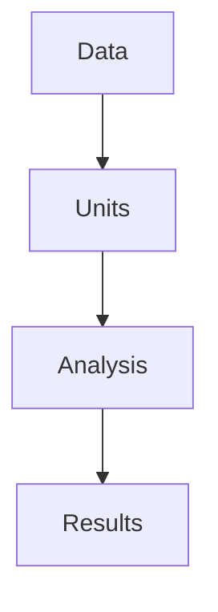

# WUS_RxResourceNeeds
Modeling the resources (personnel, quals, and equipment) needed to restore low-intensity wildfire regimes in the western United States.

# Modeling Workflow



## Analysis Units

Fireshed Project Areas from the [Fireshed Registry](https://www.fireshedregistry.org/) are the analysis units for the model. [NOTE: HUC12s or other units could be used for this purpose.]

## Model Parameters

For each fireshed project area the model calculates the following:

- Target Area (TA) — the acres of low intensity fire recommended for restoration in the fireshed. Target Area is the area within the fireshed project area that is dry forest type [Landfire BPS or Hoecker et al. 2026], with slopes less than 25% to avoid "soil movement" ([NRCS 2010](https://efotg.sc.egov.usda.gov/references/Delete/2012-9-29/Archived_338_Prescribed_Burning_120927.pdf)), that is not in designated wilderness, [not coincident with a structure?] and that is contiguous with at least 20 acres [TODO: ground this minimum threshold in data (TWIGS data for Rx Fires?) or literature]. A "priority" mask could also be used to define areas within the fireshed that have the greatest ROI from low-intensity fire restoration, such as critical weatersheds, biodiversity hotspots, and wildland urban interface (WUI).
- Target Fire Return Interval (TFRI) — the number of years between low-intensity fires to maintain the target area. TFRI is the mean fire retun interval for the Target Area. Fire return interval is from Landfire BPS.
- Target Area Landowners (initially include all fed agencies, state agency types, local government types, and private lands) this is a 
- Burn Days (BD) - the mean number of days per year with acceptable conditions for low-intensity fire. This is from [Swain et al 2023](https://www.nature.com/articles/s43247-023-00993-1). [TODO: model the distibtuion of burn days, or burn-periods?]
- Annual Fire Need (AFN) — acres of low intensity fire per year needed to achieve the target fire return interval. 
```
AFN = TA/TFRI
```
- Burn-day Fire Need (BFN) — acres of low-intensity fire per burn-day to achieve the AFN.
```
BFN = AFN / BD
```
- Unit Size Distribution (calculate from Patches of Target Area)
- Unit Complexity Distribution (for each Target Area Patch, calculate slope and roughness, within-patch fuelmodel homogeneity, adjacent fuel loading (buffer the unit by 1km? and get the mean loading via fuel model?))
- Unit Fire Behavior Distribution (average rate of spread (chains per hour) for each patch using "hot" prescription, average unit slope, and most common fuel model within patch) [TODO: model the range of fire spreads under bracketing precription scenarios ("cold" and "hot"?), or use a true distribution of rates of spread]
- Resource Mix Distribution of Engines, Dozers, Handcrews, and Helicopters (function of road access and unit size/complexity?)
- Resource Intensity (engines/acre, dozers/acre, etc.) 

- Annual Resources Required (annual acres time resource intensity)

# Model Inputs and Sources
These data are saved to data/raw/ and then processed to data/processed/ for use in the model.

| Input | Source | Format | Raw Location | Processed Location |
| -------- | -------- | -------- | -------- | -------- |
| Fireshed Registry (4th Ed.) Subfiresheds | https://www.fs.usda.gov/rds/archive/catalog/RDS-2020-0054-4 | Shapefile | data/raw/RDS-2020-0054-4.zip | data/processed/firesheds.gpkg\|layername=projectAreas |
| Landfire BPS | https://www.landfire.gov/ | Raster | data/raw/ | data/processed/ |
| Swain et al. 2023 | https://www.nature.com/articles/s43247-023-00993-1 | Table | data/raw/ | data/processed/ |
