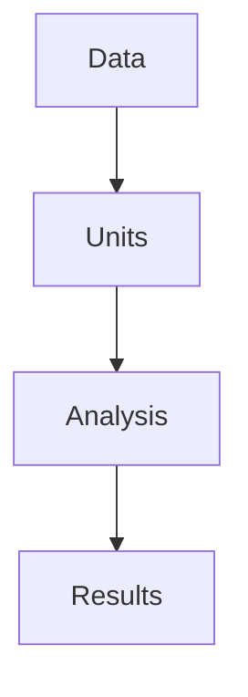

# WUS_RxResourceNeeds
Modeling the resources (personnel, quals, and equipment) needed to restore low-intensity wildfire regimes in the western United States.

# Modeling Workflow



## Analysis Units

Fireshed Project Areas from the [Fireshed Registry](https://www.fireshedregistry.org/) are the analysis units for the model. [NOTE: HUC12s or other units could be used for this purpose.]

## Model Parameters

For each fireshed project area the model calculates the following:

- Target Area (TA) — the acres of low intensity fire recommended for restoration in the fireshed. Target Area is the area within the fireshed project area that is dry forest type [Landfire BPS or Hoecker et al. 2026], with slopes less than 25% to avoid "soil movement" ([NRCS 2010](https://efotg.sc.egov.usda.gov/references/Delete/2012-9-29/Archived_338_Prescribed_Burning_120927.pdf)), that is not in designated wilderness. A "priority" mask culd also be used to define areas within the fireshed that have the greatest ROI from low-intensity fire restoration, such as critical weatersheds, biodiversity hotspots, and wildland urban interface (WUI).
- Target Fire Return Interval (TFRI) — the number of years between low-intensity fires to maintain the target area. TFRI is the mean fire retun interval for the Target Area. Fire return interval is from Landfire BPS.
- Burn Days (BD) - the mean number of days per year with acceptable conditions for low-intensity fire. This is from [Swain et al 2023](https://www.nature.com/articles/s43247-023-00993-1). [TODO: model the distibtuion of burn days, or burn-periods?]
- Annual Fire Need (AFN) — acres of low intensity fire per year needed to achieve the target fire return interval. 
```
AFN = TA/TFRI
```
- Burn-day Fire Need (BFN) — acres of low-intensity fire per burn-day to achieve the AFN.
```
BFN = AFN / BD
```

